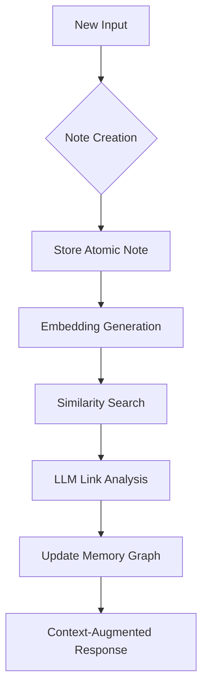

```mermaid
flowchart TD
    A[New Input] --> B{Note Creation}
    B --> C[Store Atomic Note]
    C --> D[Embedding Generation]
    D --> E[Similarity Search]
    E --> F[LLM Link Analysis]
    F --> G[Update Memory Graph]
    G --> H[Context-Augmented Response]
```